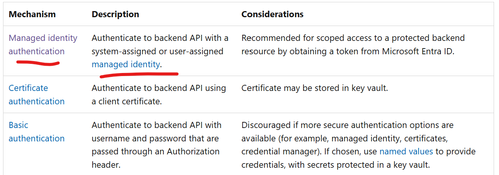

# Validate incoming call to APIM and initiate call to backend with APIM's managed identity

##  This example demonstrates how to validate an incoming call to Azure API Management (APIM) and initiate a call to the backend using APIM's managed identity.

## References 

https://azure.github.io/apim-lab/apim-lab/7-security/security-7-3-managed-identities.html  

https://learn.microsoft.com/en-us/azure/api-management/authentication-managed-identity-policy#use-managed-identity-to-authenticate-with-a-backend-service

https://learn.microsoft.com/en-us/azure/api-management/authentication-authorization-overview#service-side-options  

## Code samples  

[APIM policy sample](./policy_validate_jwt_miauth.xml)

[Test sh script code with client credentials flow](./clientcredflow.sh)

[Test python code with client credentials flow](./clientcredflow.py)